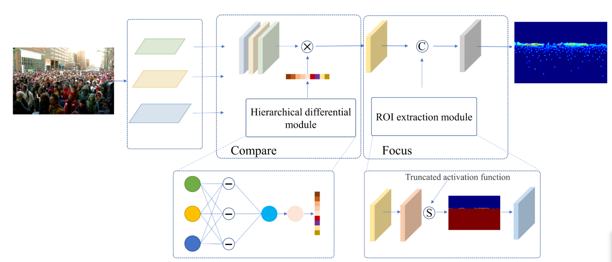
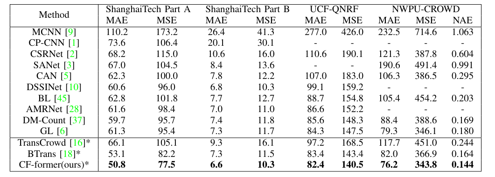

# Compare and Focus: Multi-Scale View Aggregation For Crowd Counting
## Overview

## Crowd Counting Results




*Note: CF-former represents our proposed method.


# Training
Take a look at the arguments accepted by ```train.py```
* prepare the dataset
* update root "data-dir" in ./train.py.
* load pretrained weights of ImageNet-1k in ./Networks/ALTGVT.py.
* pretrained weights [link](https://drive.google.com/file/d/1um39wxIaicmOquP2fr_SiZdxNCUou8w-/view)
* launch with ```python train.py```

# Testing
* python test.py
* Download the pretrained model on QNRF from Baidu-Disk(提取码: 7dqt) [link](https://pan.baidu.com/s/1Ul0iHgAs6rWVRe58iBxsjA?pwd=7dqt )


# Environment
	See requirements.txt

